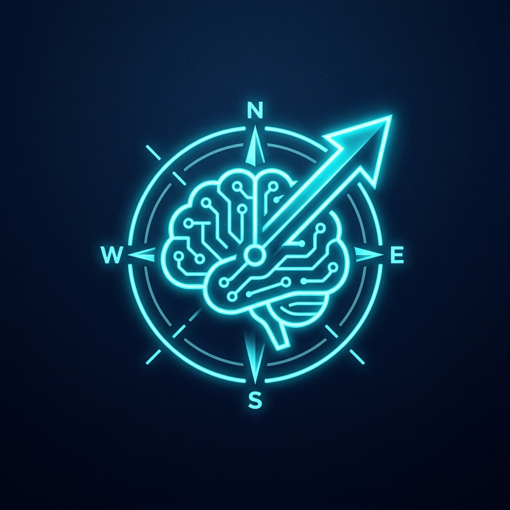

  
  <h1>🚀 Data Science & AI Mentorship Hub</h1>
  
<em>Your Blueprint from Zero to AI Engineer. Break into the industry faster.</em>

  
  
  
  

---

## 👨‍🏫 About the Mentor

Hi, I'm **Dimitris Karydas**! 👋

I am a professional **AI Instructor & Data Analyst Instructor** and a PhD Candidate. I have spent years writing code, building MLOps pipelines, and studying the depths of Artificial Intelligence. 

But my true passion? **Teaching and guiding others.**

As an active Instructor, I've seen hundreds of junior developers get stuck in "Tutorial Hell." They know how to write a Python `for-loop`, but they don't know how to pass a technical interview, how to structure a GitHub portfolio, or what tools the industry actually uses.

That's why I created this hub. I know exactly what it takes to transform a student into a hired professional.

---

## 💎 Free Resources (Start Here)

I have open-sourced the exact Roadmaps and Strategies you need to succeed.

### 🗺️ Career Roadmaps (Updated for 2025)
* [**01: The Modern Data Scientist Roadmap**](./Roadmaps/01_Data_Scientist_Roadmap.md)
* [**02: The AI / MLOps Engineer Roadmap**](./Roadmaps/02_AI_Engineer_Roadmap.md)
* [**03: The Modern Data Engineer Roadmap**](./Roadmaps/03_Data_Engineer_Roadmap.md)
* [**04: The Machine Learning Engineer Roadmap**](./Roadmaps/04_Machine_Learning_Engineer_Roadmap.md)

### 🎤 Interview Preparation
* [**SQL & Python Cheatsheet (Top Patterns)**](./Interview_Preparation/SQL_and_Python_Cheatsheet.md)
* [**The STAR Method (Acing Behavioral Rounds)**](./Interview_Preparation/Behavioral_STAR_Method.md)

### 💼 Portfolio & Resume
* [**How to write an ATS-Friendly Resume**](./Career_and_Portfolio/Resume_Tips.md)
* [**Cold Message Templates for LinkedIn**](./Career_and_Portfolio/Cold_Message_Templates.md)

---

## 🤝 1-on-1 Mentorship Services

Reading roadmaps is great, but nothing beats personalized guidance. 
If you want to accelerate your career, I offer 1-on-1 mentorship sessions where we focus purely on **your** goals.

### 🗓️ My Mentorship Offerings
Curious about the exact services I provide and my technology stack? 
👉 **[Read my Professional Services & Mentorship Overview Here](./Mentorship_Syllabus.md)**

### What we can do together:
1. **Resume & Portfolio Roast:** I will brutally review your GitHub and Resume to make them stand out to Senior Hiring Managers.
2. **Mock Technical Interviews:** We will simulate a real Data Science or SQL interview.
3. **Architecture Guidance:** Stuck on a personal project? I'll help you design the AWS/GCP architecture and debug the code.
4. **Career Transition Strategy:** Moving from Academia or another field into AI? I'll give you the exact blueprint.

### 📅 Book a Session
Stop guessing and start building your career. Let's chat!

👉 **[Book a 30-Minute Mentorship Session with me on Calendly](https://calendly.com/karidasdimitris23/30min)**

*You can also connect with me on **[LinkedIn](https://www.linkedin.com/)** for daily tips and updates.*
